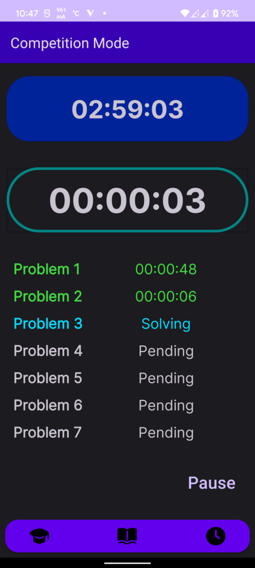

# CP Analyzer

This application can be used to check your performance in a Programming Competition.

1. You can check how long you took to solve a particular number of question
2. There is also a mode where you can check how much time you took to solve a single quesiton.

## Entry Page

1. Enter Total time provided to complete the given set of questions. **Remember time should be in minutes**.
2. Enter the total number of question provided in the competition.
3. Submit with custom values. **If values provided are other than Integers, default values will be selected automatically.**
   

## Competition Page

1. Timer on top will count downward and will represent the time remaining for the competition.
2. Timer below will count how much time you took to solve a single question.
   
3. If you have completed a single problem you can click on the 2nd timer which will how much time you took to solve that problem and will reset automatically.
4. To reset the whole timer hold the start/resume/pause button.
   

## Practise Mode

1. This mode can be used to solve a single problem with the given steps. (i.e. read prob, think of bruteforce solution)
2. If you are done with a single step than press on the counter it will save the time you took on a particular step.
   

## History Mode

1. This will tell your performance of last 15 competition you participated in.
2. On the left hand side it will provide the date and time of the competition and in the right hand side it will provide the number of questions you solved and time of competition.
   
